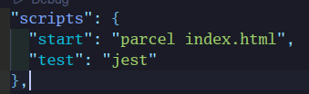
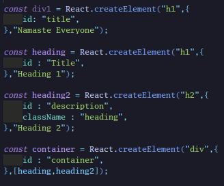

# Day3 of Learning the the react

### Today's Learning 👎

1. To run your build :- "**npx parcel index.html**",
   We can avoid this using this simple thing
2. We can achieve the same thing by editing the **scripts** in the **package.json** so in order to do that we have to write **"start" : "parcel index.html**

> 

3. We can directly **"npm run start** to run the same and it will work the same.
4. In the production builds to remove debug or logging statements, reducing the size of your JavaScript bundle and potentially improving runtime performance we have to remove the **console.log** statements we have to use **"plugins":** **[****"babel-plugin-transform-remove-console"****]**
5. To install this run **npm install babel-plugin-transform-remove-console --save-dev**


6. Above createElement making in big production projects using react is difficult so use **JSX** as it is much easier to work with.

---

## React Element vs React Component

In React, there are two fundamental concepts: React elements and React components. While they are closely related, they represent different aspects of building UIs.

### React Element

A **React element** is a plain JavaScript object that represents a virtual DOM node. It serves as a blueprint for what should be rendered on the screen. React elements are typically created using JSX syntax or the `React.createElement()` function. They are immutable and lightweight, representing the structure of UI components without any associated logic.

Example:

```jsx
const element = <h1>Hello, world!</h1>;
```

## React Component


A **React component** is a JavaScript function or class that can accept input (props) and returns a React element or a tree of React elements. Components are reusable building blocks that encapsulate a piece of UI and its behavior. They can be either functional components or class components. Functional components are simple functions that accept props and return JSX, while class components are JavaScript classes that extend `React.Component` and have a `render()` method. Components can have their own state, lifecycle methods, and event handlers, allowing them to manage their behavior and update in response to user interactions or data changes.

Example:

```
// Functional component
const Greeting = (props) => {
    return <h1>Hello, {props.name}!</h1>;
};

// Class component
class Greeting extends React.Component {
    render() {
        return <h1>Hello, {this.props.name}!</h1>;
    }
}
```

## For All the other checkout the codes.

