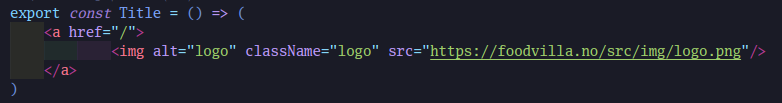
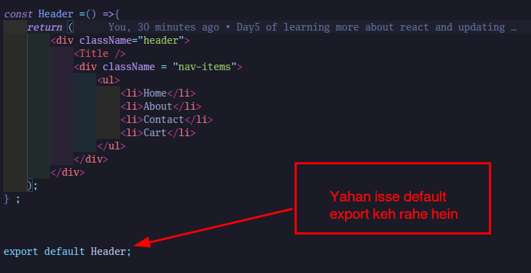

# **Day 5 of Learning more about React while building a Food Villa Website**

* [ ] We can import Components from different Folders and there are two types of the imports.
  There are two types of the total imports
  
  * 1. Default Import
  * ```
    import Header from "./components/headers";
    ```
  * 2. Named Import
  * ```
    import { Header } from "./components/headers";
    ```
  * If we want to import all the components from the single file we can use like this;
  * ```
    import * as obj from "./components/headers";
    ```
  * 3. **Before importing the components you have to export them from the components file destination.**
  * The two ways are
    * If we are importing as named then we have to use it like this else for default :
    * 
    * Another way is Normal import
    * 

---

* [ ] It is a good practice to keep the hard coded things in a new file naming **config.js OR constants.js*

    * 

